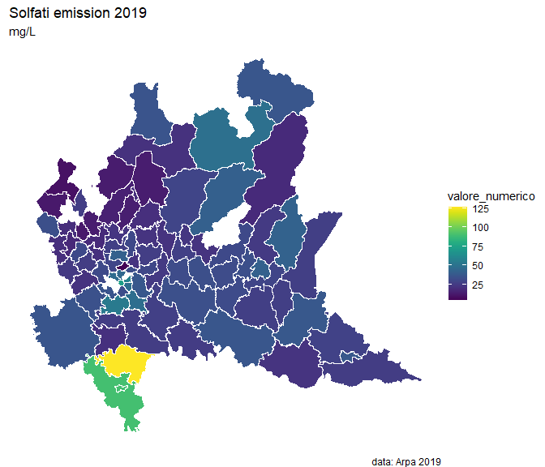

Data Visualization
================
Friday, 17<sup>th</sup> May 2024

## Introduction

``` r
knitr::opts_chunk$set(fig.path='../notebook/4_data_visualization_files/figure-gfm/')
library(data.table)
library(geojsonio)
library(ggplot2)
library(viridis)
library(duckdb)
library(arrow)
library(broom)
library(sp)

source("../src/spatial_library.R")
source("../src/key_amazon.R")
```

``` r
# Create duckdb connection
duckdb_con = DBI::dbConnect(duckdb::duckdb())

DT = open_dataset("s3://envbran/WQ/WQ_underground.arrow",format = "arrow") 
DT = DT |> to_duckdb(table_name = "test", 
                     con = duckdb_con)

WC = DT |>
  filter(anno == "2019") |>
  as.data.table() 

WC[, lat := unlist(WC$lat)]
WC[, lng := unlist(WC$lng)]

WC = map_point(district, WC, "district_id")
WC[, valore_numerico := as.numeric(gsub(",",".",valore_numerico))]
```

    ## Warning in eval(jsub, SDenv, parent.frame()): NAs introduced by coercion

``` r
WC = WC[parametro == "Solfati"]
WC = WC[,.(valore_numerico = mean(valore_numerico,na.rm = T)), by = district_id]
WC[, district_id := as.numeric(as.character(district_id))]
```

``` r
# Health district 
district =  geojson_read("https://www.dati.lombardia.it/resource/9n45-7bpc.geojson",
                         what = "sp")
dt_district = tidy(district)
dt_district = data.table(dt_district)
dt_district = merge(dt_district,
                    district@data[,c("objectid_1","codice_ats","distretto","descrizion")],
                    by.x = "id", by.y = "objectid_1")
dt_district$id = as.numeric(dt_district$id)
dt_district = merge(dt_district,WC, by.x = "id", by.y = "district_id")
```

``` r
map_lomb = ggplot() +
  geom_polygon(data = dt_district, aes(x = long, y = lat, 
                                          group = group, fill = valore_numerico), 
               color="white") +
  theme_void() +
  scale_fill_viridis() +
  coord_map() + 
  labs(title = "Solfati emission 2019",
       subtitle = "mg/L",
       caption = "data: Arpa 2019")
map_lomb
```


